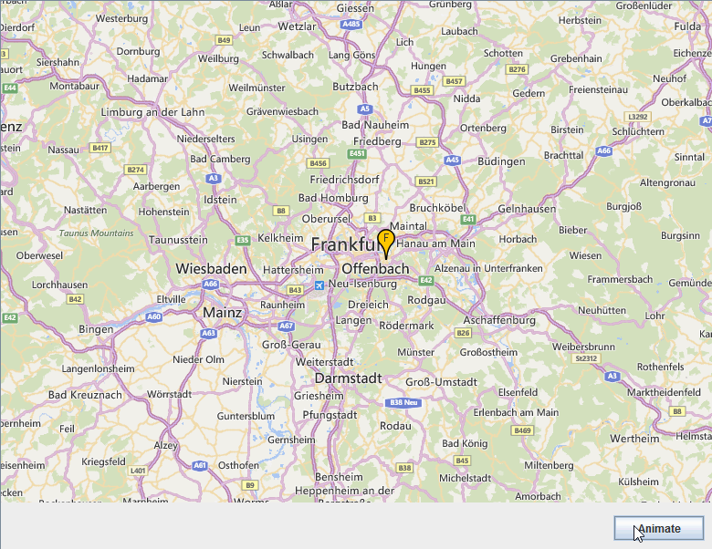

# Jxmapveiwer animation example

An example of jxmapviewer animation using VividSwingAnimations

## Description

This example use [JxMapviewer](https://github.com/albertotn/jxmapviewer2) to display a marker on map an then move it using 
[VividSwingAnimations](https://github.com/albertotn/VividSwingAnimations)

## How to build

Install maven, clone both [JxMapviewer](https://github.com/albertotn/jxmapviewer2) and [VividSwingAnimations](https://github.com/albertotn/VividSwingAnimations) and then use: maven clean install

## License

Apache License 2.0, see LICENSE file

